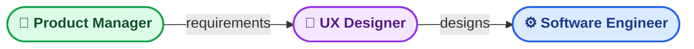
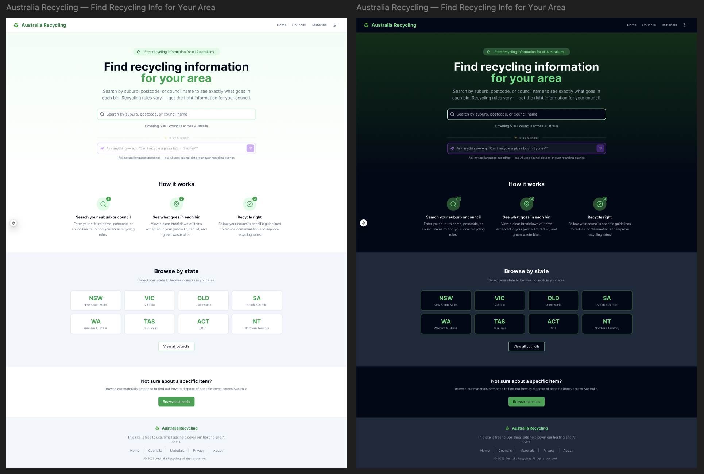

# Australia Recycling

Recycling rules differ across every one of Australia's ~537 local government areas. This project makes them searchable in one place — [australiarecycling.com.au](https://australiarecycling.com.au).

Jump straight to [Setup](#setup)

## Features

- **Full-text search** — council, suburb, and material autocomplete with 300ms debounce, keyboard navigation, and ARIA combobox semantics
- **Council pages** — SSR at `/councils/{slug}` with colour-coded bin sections, material-level disposal instructions, and FAQPage JSON-LD schema
- **Material catalogue** — `/materials/{slug}` with category filtering; every page independently indexable
- **SEO-first** — server-side rendered throughout, auto-generated sitemap and robots.txt, Lighthouse SEO target ≥ 95
- **Dark mode** — CSS variable token system; theme resolves at the variable layer so zero per-element `dark:` overrides are needed
- **AI chat** — conversational interface on council pages backed by a LiteLLM proxy; Phase 2 wires the RAG pipeline
- **Design–code sync** — Figma designs kept current via the Figma MCP integration


## Process

This project was scoped, designed, and built entirely with Claude running as three specialised agents:



| Agent | Output |
|-------|--------|
| 🎯 **Product Manager** | PRD, user stories, acceptance criteria, phased roadmap → [`docs/PRD.md`](docs/PRD.md), [`docs/plan.md`](docs/plan.md) |
| 🎨 **UX Designer** | Figma designs, design system, component specifications → [`docs/DESIGN.md`](docs/DESIGN.md) |
| ⚙️ **Software Engineer** | Full-stack implementation, dev container, CI/CD, Figma MCP integration |

### 1. Product

The PM agent was given a single-line brief and produced a full PRD — personas, user stories with acceptance criteria, non-functional requirements, a phased roadmap, and success metrics. This drove every subsequent decision: what to build, in what order, and what done looks like.

> *"Many Australians recycle by guessing. This leads to wishcycling — putting items in the recycling bin in hope, which contaminates entire loads and results in them going to landfill."*
>
> — Goal G1: users can find their council's bin rules in < 30 seconds. — [`docs/PRD.md`](docs/PRD.md)

### 2. Design

All screens were authored directly in Figma by the UX Designer agent using the [Figma MCP](https://mcp.figma.com) `generate_figma_design` tool, then captured in light and dark mode via Playwright. The Software Engineer agent consumed those designs in-context using `get_design_context` and `get_screenshot` — closing the loop between design and code without leaving the editor. [`docs/DESIGN.md`](docs/DESIGN.md) covers the design principles, component system, and token decisions derived from the PRD personas.



### 3. Coding

The full stack was implemented with Claude Code against the PRD acceptance criteria, using the Figma MCP to pull design context directly into each component. Project conventions, pre-commit hooks, dev container config, and Claude coding instructions were established upfront to enforce best practices and keep the local development experience frictionless for all contributors.

---

## Setup

**1. Configure environment**

```bash
cp .env.example .env
# Required: DATABASE_URL, ANTHROPIC_API_KEY
```

**2. Open in dev container**

Install the [Dev Containers](https://marketplace.visualstudio.com/items?itemName=ms-vscode-remote.remote-containers) extension → **Reopen in Container**. Dependencies are pre-installed.

**3. Start the stack**

VS Code runs **Full Stack: Start** automatically on container open. To trigger manually: `Ctrl+Shift+P` → **Tasks: Run Task** → **Full Stack: Start**.

| Service | URL |
|---------|-----|
| Frontend | http://localhost:3000 |
| Backend API | http://localhost:8080 |
| Database | localhost:5432 |


## Stack

| Layer | Technology |
|-------|-----------|
| Backend | Java 21, Spring Boot 3, Gradle |
| Frontend | Next.js 15, React 19, TypeScript |
| UI | Tailwind CSS, shadcn/ui |
| Database | PostgreSQL 16, pgvector |
| AI | LiteLLM proxy, Claude API |
| Infrastructure | Docker Compose (dev), Terraform + GCP Cloud Run (prod) |


## License

MIT
